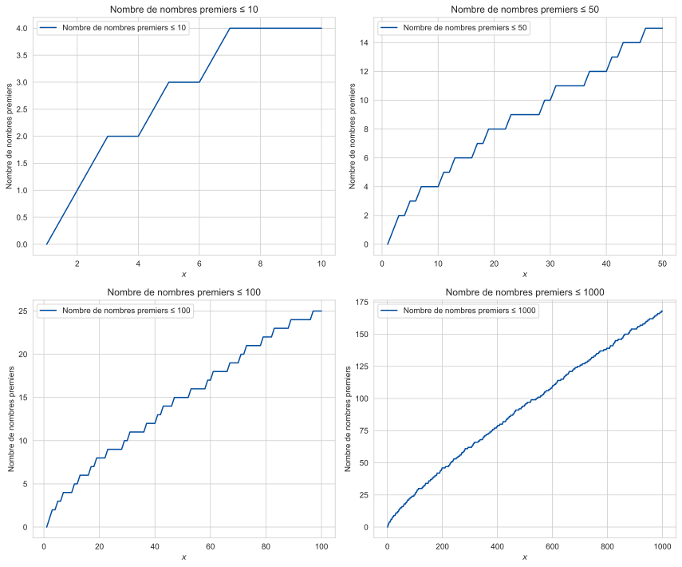
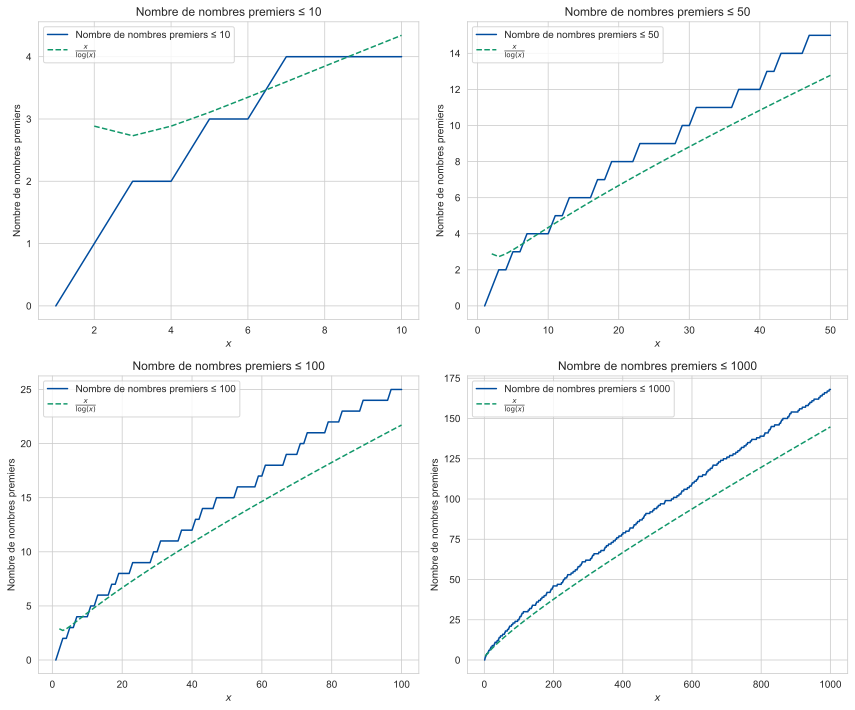
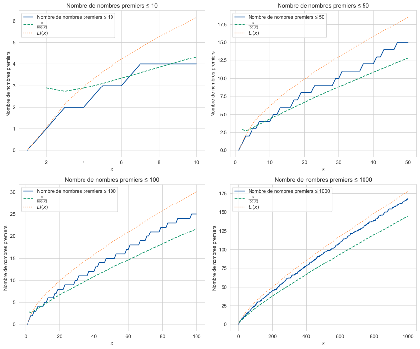
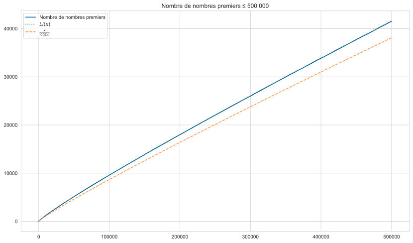
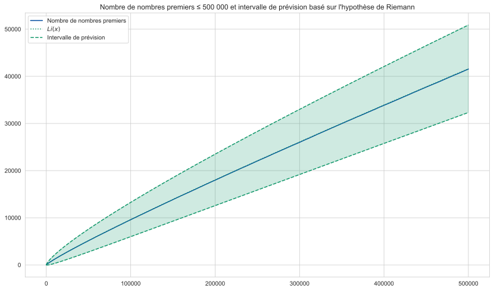
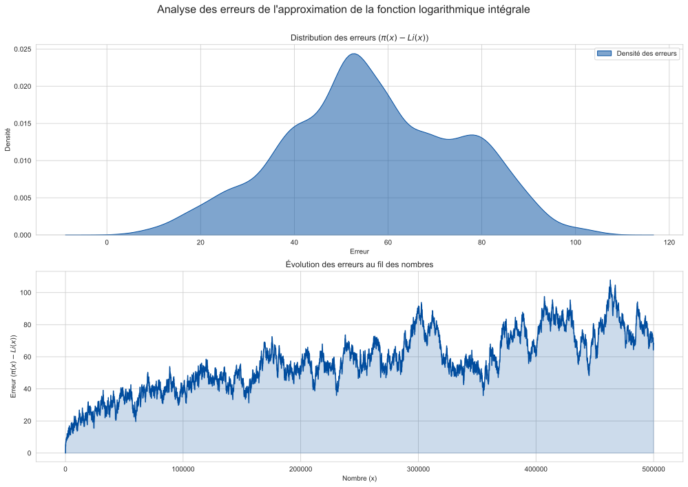
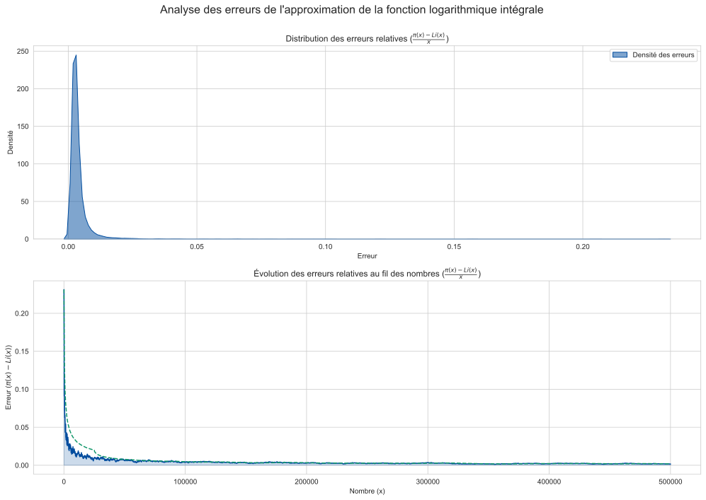
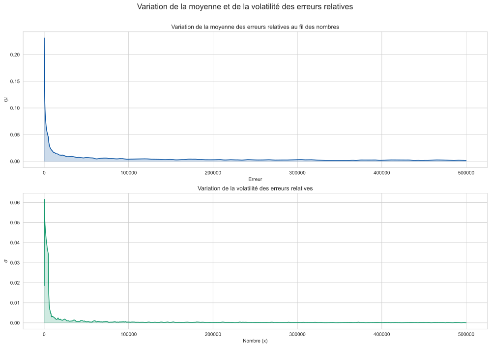
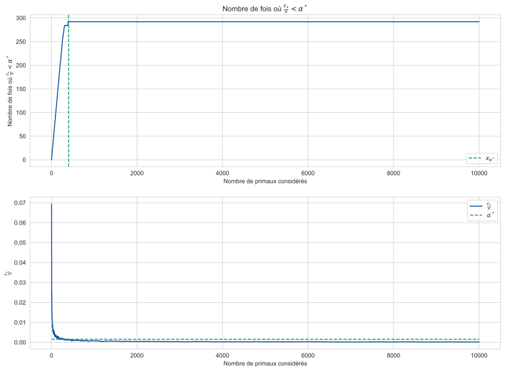

### Introduction
"Un nombre entier plus grand que 1 n'ayant que deux diviseurs distincts: 1 et lui-même."

Cette définition, découverte il y a bien longtemps pour la plupart et oubliée presque aussitôt pour la majorité, définit l'un des concepts fondamentaux de l'arithmétique: les <b>nombres premiers</b>. 

Premiers car, tout nombre entier supérieur ou égal à deux, se décompose en produit de nombres premiers d'une seule façon (à l'ordre près des facteurs - je laisse le lecteur se convaincre que 1x2 est équivalent à 2x1). 

Fruit de l'intuition des uns et des découvertes des autres, notre compréhension de ces éléments singuliers aux propriétés intéressantes s'est progressivement affinée avec le temps. De Euclide à Riemann en passant par Eratosthène, Euler ou Gauss, nombreux sont ceux ayant étudiés, directement ou indirectement les propriétés de ces éléments primaux.

Pourtant certains mystères demeurent sur ces objets d'apparence si simple. Parmi-eux, se trouve la conjecture de Legendre: "Il existe toujours au moins un nombre premier entre $2n$ et $(n+1)^2$". Ou encore, la célèbre conjecture de Goldbach: "Tout nombre pair strictement supérieur à 2 peut s'écrire comme la somme de deux nombre premiers". 

Je laisse au lecteur studieux le soin de chercher à démontrer ces conjectures (si tant est qu'elles soient démontrables), et je propose aux autres de pencher non sur les propriétés de ces nombres, mais sur leur répartition. 

En effet, <b>comment</b> évoluent les nombres premiers ? Concrètement, si je prends les 10 premiers nombres entiers, combien sont-ils premiers ? Et pour les 100 premiers ? Et quid des 1000 premiers ? En bref, comment évolue la proportion des nombres premiers parmi l'ensemble des nombres entiers. Et peut-on en estimer la variation ?

Accordons au lecteur dubitatif vis-à-vis de l'intérêt de cette lecture, que c'est un sujet purement théorique. Le tout un chacun ne se trouvera pas perturbé dans son sommeil s'il ne sait répondre à cette question. Mais le lecteur curieux trouvera je l'espère de l'intérêt dans cette lecture, effleurant le monde si particulier de la théorie des nombres.

### La répartition des nombres premiers
Commençons par quelques graphiques simple, montrant l'évolution du nombre de nombre premiers entre 0 et 10, 50, 100 et 500. J'informe ici le lecteur qu'il trouvera plus loin l'expression de "nombre de primaux sous une certaine borne (notée $x$)", manière plus lisible mais moins vocabulairement correcte de parler du nombre de nombre premiers inférieurs ou égaux à la dite borne (toujours notée $x$).

Nous voyons une augmentation en escalier, la fréquence d'augmentation semble diminuer au fil du temps. Pour formaliser le propos, notons $\pi(x)$ la <b>fonction calculant le nombre de nombre premiers inférieurs ou égaux à une borne $x$</b>. Cette fonction sera au coeur de notre analyse.

Sur les graphiques précédent, le lecteur à l'oeil avisé aura peut-être observé un phénomène de raréfaction des nombres premiers. Car de fait, on observe que la part des nombres premiers observé diminue lorsque la borne considéré augmente. 

Autrement dit, $\lim_{x \to \infty} \frac{\pi(x)}{x}=0$. Cette formule, démontrée par Gauss, nous permet de faire une première approximation du nombre de primaux sous une borne $x$:

$\pi(x) \sim \frac{x}{log(x)}$

Cette estimation est pertinente. Car le logarithme présente la propriété d'une croissance constante, mais de moins en moins rapide - ce phénomène de <b>raréfaction</b> recherché. Voyons ci-après le résultat de cette approximation:

Si cette estimation est un bon premier pas, elle ne semble pas suffisante. En effet, l'estimation <b>sous-estime</b> tout le temps la vraie valeur de $\pi(x)$, et l'erreur de prévision est parfois importante. 

Gauss propose une formule de prévision un peu plus fine. Au lieu de faire une estimation ponctuelle, en divisant la borne étudiée par son logarithme, il utilise une intégrale pour gagner en précision. Cette fonction se nomme le <b>logarithme intégral</b> (nommé $Li(x)$) et sa formule est la suivante:

$\pi(x) \sim Li(x)=\int_2^x\frac{dx}{log(x)}$

Alors que l'approximation précédente sous-estimait toujours (et de façon importante) le vrai nombre de nombre premiers sous la borne $x$, le logarithme intégrale propose une <b>approximation bien plus convaincante</b>:

Il semblerait qu'asymptotiquement, c'est-à-dire lorsque l'on augmente la borne $x$ considérée, le logarithme intégral soit un bon estimateur de $\pi(x)$ car l'un semble converger vers l'autre ! Les deux courbes s'épousant dans une danse infinie.

Pour en avoir le coeur net, affichons la variation du nombre de nombre premiers et $Li(x)$ sur un intervalle plus large:

Voila qui confirme ce qui fut dit plus haut: <b>le logarithme intégral semble être un estimateur idéal du nombre de primaux sous une certaine borne !</b> 

Le lecteur curieux sera peut être heureux d'apprendre que j'ai essayé plusieurs choses pour améliorer cette approximation, mais le logarithme intégral est toujours le plus robuste. Il capture la lente mais persistante variation avec une efficacité remarquable, et sa relative simplicité en terme de calcul en font un estimateur optimal.

### La question de l'incertitude
#### L'incertitude sous l'hypothèse de Riemann
Il n'aura pas échappé au lecteur avisé que le logarithme intégral, s'il est un bon prédicteur du nombre de nombre premiers inférieur à une certaine borne, n'en décrit toutefois pas le comportement exact. De fait, les premiers graphiques nous montraient toujours une différence entre la prévision du logarithme intégral et la réalité.

<b>Peut-on quantifier cette erreur ?</b> Un peu de terminologie dans un premier temps. On définit l'erreur comme la différence entre la prévision du logarithme intégral et la réalité. Autrement dit:

$e_x = Li(x) - \pi(x)$

Notons que l'estimation du logarithme intégrale est toujours supérieure à la vraie valeur de $\pi(x)$, c'est à dire que <b>l'erreur est toujours positive</b>. Au besoin, nous pouvons utiliser la valeur absolue de l'erreur pour éviter les effets de compensation, soit: 

$e_x = |Li(x) - \pi(x)|$.

La question qui survient alors est la suivante: Pouvons-nous établir un <b>intervalle d'incertitude</b>, c'est-à-dire un intervalle pour lequel nous sommes certains que la vraie valeur du nombre de primaux sera compris dedans ?

La technique la plus simple est de supposer une <b>erreur symétrique</b>, définie selon un certain paramètre $\alpha$. L'intervalle d'incertitude est alors simplement le logarithme intégral +/- ce coefficient. Formellement, on veut trouver $\alpha$ tel que:

$Li(x) - \alpha \leq \pi(x) \leq Li(x) + \alpha$

Ce qui revient à dire qu'on veut un intervalle, pour lequel la <b>probabilité d'obtenir la valeur de $\pi(x)$ à l'intérieur de ce dernier est de 1</b>. Soit:
$\mathbb{P}\left[\pi(x) \in \mathbb{C}(x, \alpha)\right] = 1$

$avec \space \mathbb{C}(x, \alpha) = \{Li(x) - \alpha,\ Li(x) + \alpha\}$

Le lecteur mathématicien sait peut-être que Riemann à travaillé sur le sujet des nombres premiers. L'une des conséquences de sa célèbre hypothèse éponyme à savoir que "tous les zeros non triviaux de la fonction Zeta se situent sur la droite critique" concerne précisément la répartiton des nombre premiers. 

Riemann nous dit que le terme d'erreur ($\alpha$) que nous cherchons est défini par $\sqrt(x)log(x)$. Plus précisément <b>si l'hypothèse de Riemann est vraie</b>, alors:

$\pi(x)=Li(x)+O(\sqrt(x)+log(x))$

Regardons graphiquement ce que cela implique:

Les bandes sont calculés respectivement en ajoutant et en soustrayant $(\sqrt(x)+log(x))$ à l'estimation initiale du logarithme intégral, $Li(x)$. Pour revenir à la notation précédente, si l'hypothèse de Riemann est vraie, alors, $\alpha_{RH}=\sqrt(x)+log(x)$

L'intervalle de prévision est alors: $\mathbb{C}(x, \alpha_{RH}) = \{Li(x) - \alpha_{RH},\ Li(x) + \alpha_{RH}\} \leftrightarrow \mathbb{C}(x, \alpha_{RH}) = \{Li(x) - \sqrt(x)+log(x),\ Li(x) +  \sqrt(x)+log(x)\}$.

Ma proposition est la suivante: <b>est-il possible de proposer un coefficient d'incertitude $\alpha_{star}$ qui soit meilleur, que celui de Riemann ?</b> C'est en ce sens que nous voulons "battre" Riemann.

#### Vers un nouveau coefficient d'incertitude
Définissons d'abord ce qui est entendu par un "meilleur" coefficient d'incertitude. Le coefficient doit respecter deux conditions:
- La <b>validité, c'est-à-dire que l'ensemble des valeurs de $\pi(x)$ doivent être comprises dans l'intervalle $C(x, \alpha_{star})$</b> pour un coefficient candidat $\alpha_{star}$ et une borne $x$ donnée. Notons au passage que $\alpha_{RH}$ est un coefficient valide car, sur le graphique précédent, l'ensemble des valeurs de $\pi(x)$ sont comprises à l'intérieur de l'intervalle de prévision. La validité se formalise ainsi: 

$\mathbb{P}\left[\pi(x) \in \mathbb{C}(x, \alpha)\right] = 1$. 

- L'<b>efficacité, c'est-à-dire proposer l'intervalle le plus petit possible</b>. Dans notre cas, cela se traduit par avoir un coefficient $\alpha_{star}$ qui soit le plus petit possible (en sorte que la différence entre la borne supérieure $Li(x) + \alpha_{star}$ et la borne inférieure $Li(x) - \alpha$ soit la plus petite possible). A ce sujet, on remarque que le coefficient d'incertitude proposé par Riemann semble très large, et donc, n'est peut-être pas le plus efficice.

Evidemment, le lecteur perspicace aura remarqué que <b>ces deux conditions jouent l'une contre l'autre</b>. En effet, si l'on ne veut un coefficient qui ne soit qu'efficace, alors le meilleur coefficient d'incertitude est 0. 

A l'inverse, si l'on ne veut un coefficient qui ne soit que valide, un coefficient infini serait une très bonne solution. On veut donc un coefficient qui soit <b>valide et efficace</b>.

Alors comment procéder ? Considérons ici les erreurs de prévision, les $\epsilon_x$ mentionnés plus haut. Observons comment cette erreur varie lorsque l'on fait varier $x$:

Le second graphique nous informe sur quelque chose de très intéressant. J'invite le lecteur à regarder les axes. Alors que la borne maximum augmente jusqu'à 500 000, l'erreur maximum observée n'est elle que de 100. 

Il semblerait que si l'on rapporte l'erreur à la borne observée, <b>l'erreur relative que l'on obtient diminue progressivement lorsque la borne considérée augmeente</b>. Voyons plutôt:

Ce que le second graphique nous dit, c'est que <b>plus l'on observe une borne élevée, plus l'erreur de prévision relative commise par la fonction logarithme intégrale diminue</b>. 

Plus encore, plus la volatilité (c'est à dire le spectre de valeurs prises par cette erreur relative) diminue également. Je soupçonne que cette observation soit dû au phénomène de raréfaction mentionné plus haut. Pour en avoir le coeur net, regardons la moyenne et la volatilité mobile de l'erreur relative.

<b>Posons l'hypothèse que cette observation est valable</b>, et persistera quelle que soit la borne. Autrement dit, admettons:
$\lim_{x \to \infty} \frac{\pi(x)-Li(x)}{x}=0$

Fort de ces analyses, le lecteur habile pourrait alors estimer $\alpha_{star}$ de façon dynamique, en ré-estimant la moyenne de la distribution et sa volatilité à chaque $x$ observé, afin de les faire évoluer dynamiquement avec $x$. On pensera ici éventuellement à utiliser l'élégant filtre de Kalman.

Nous proposons l'approche naive suivante. <b>Fixons un seuil arbitraire</b> à partir des erreurs relatives des premières valeurs de $x$. Si mon est hypothèse est vraie, alors <b>toutes mes erreurs futures se situeront en dessous de ce seuil</b>. 

Fixons ce seuil $\alpha_{star}$ à 0.015% par exemple. Notons $x_{\alpha_{star}}$ la borne pour lequel l'erreur relative moyenne passe le seuil $\alpha_{star}$. On obtient:

Si notre hypothèse est valable, cela signifie que $Li(x) - \alpha_{star}.Li(x) \le \pi(x) \le Li(x) + \alpha_{star}.Li(x)$
$\forall x > x_{\alpha_{star}}$

Autrement dit, tout nombre supérieur au nombre $x_{\alpha_{star}}$, sera compris dans notre intervalle de prévision. L'intervalle est donc valide !

Nous avons donc un nouveau seuil $\alpha_{star}$ pour "défier" celui de Riemann $\alpha_{RH}$. Reste à savoir s'il est plus efficace (autrement dit, "moins large"). Pour ce faire nous pouvons utiliser le crible d'Eratosthène pour estimer $\pi(x)$ pour $x$ allant jusqu'a 5 millions. 

Cela nous permet de comparer les deux méthodes d'estimation de l'incertitude et également de nous assurer que les hypothèses posées sur un échantillon sont valables pour un autre échantillon plus grand. Voyons plutôt:

Dans les deux cas, <b>le taux de couverture est de 100%</b> - notre hypothèse semble être vérifiée. Par ailleurs, le lecteur peut observer que l'intervalle calculé via $\alpha_{star}$ est plus <b>efficicace</b> que celui basé sur l'hypothèse de Riemann. Nous avons donc en un sens "battu" Riemann dans l'estimation de l'erreur de prévision sur la répartition des nombres premiers sous une borne donée !

### Conclusion
Evidemment, ce n'est pas pertinent de parler de "battre" Riemann. 

D'abord, Riemann n'a pas travaillé en détail sur le sujet de l'estimation de l'incertitude. Il n'avait besoin dans ses travaux que l'approximation du logarithme intégrale. Son estimation découle de son hypothèse, concernant la fameuse fonction $\zeta$. 

Plus encore contrairement à Riemann, le résultat présenté n'a aucune garantie asymptotique: il se peut que pour un certain $x$ très grand, mon hypothèse ne tienne plus. Alors, l'estimation deviendra invalide.

L'intérêt de ce travail est cependant de montrer qu'il est possible d'utiliser les méthodes modernes d'analyse de données, afin d'analyser la répartition des nombres premiers, et éventuellement de préciser leur estimation. 

Evidemment, la méthode présentée se base sur une heuristique simple, cependant, bien des raffinements sont possibles pour l'améliorer. Je laisse au lecteur ambitieux, le soin de reprendre le flambeau !